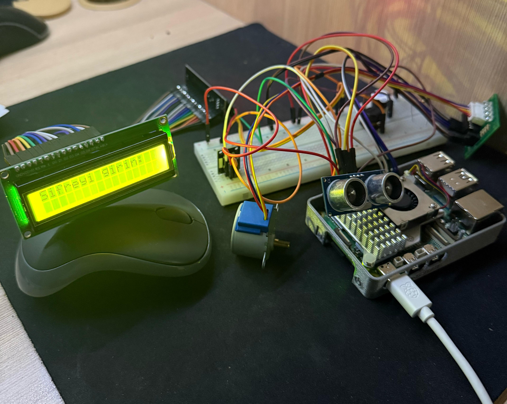
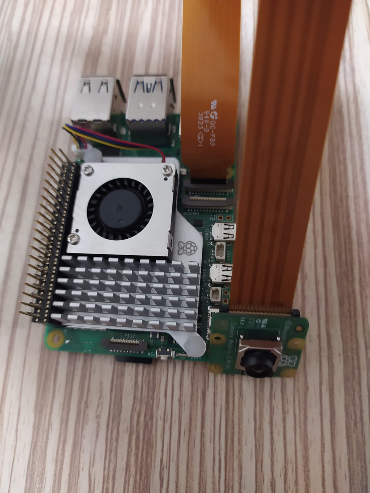
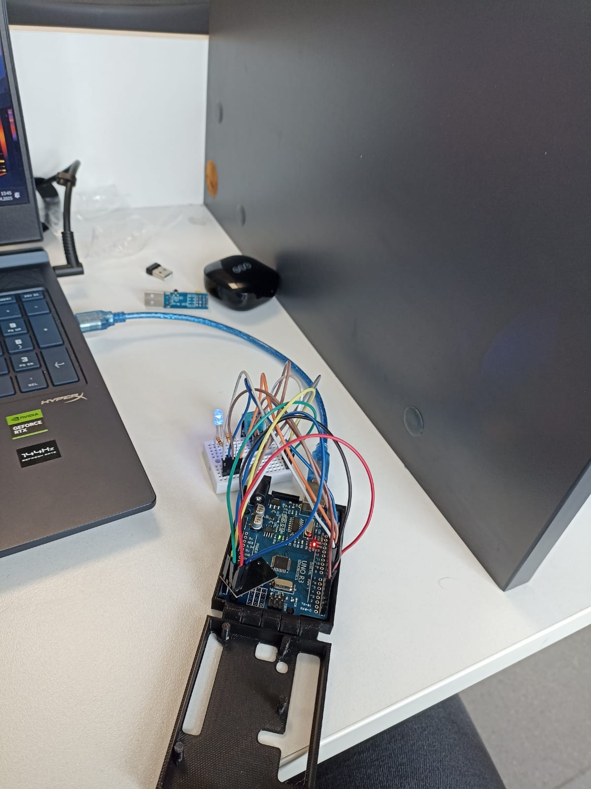
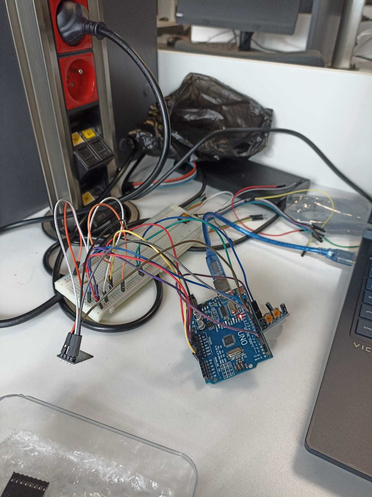
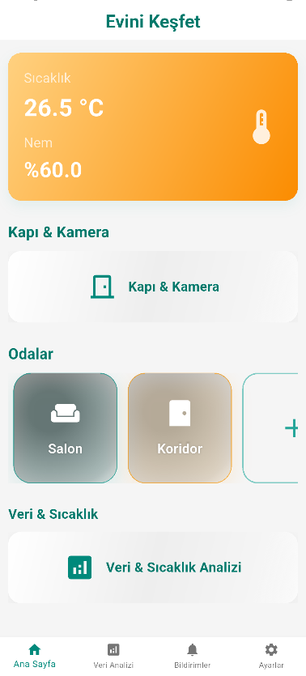
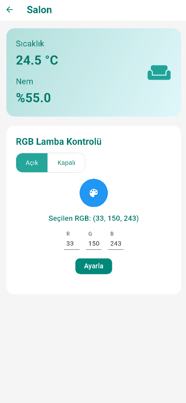
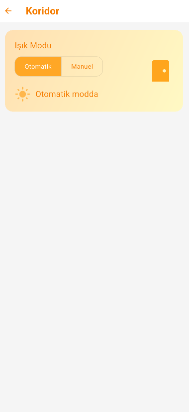
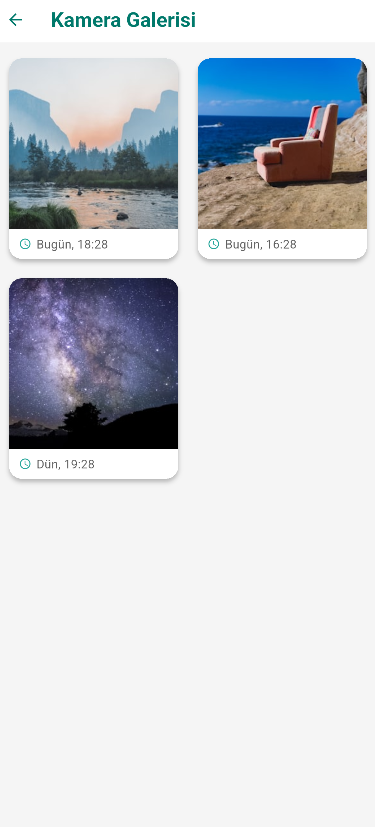
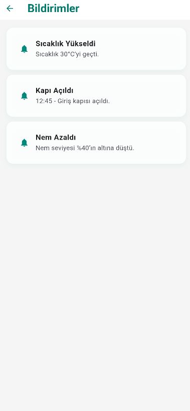

# 1. Proje Konusu  
Evini Keşfet Akıllı Ev Sistemleri, güvenlik, konfor ve enerji verimliliği odaklı bir IoT çözümü geliştirmeyi amaçlar.
Sistem; eve giriş kontrolü, uyarı bildirimleri, uzaktan kapının izlenmesi, aydınlatma ve sensör modüllerini kontrol etmeyi bir mobil uygulama üzerinden sunar.

# 2. Özet 
Evini Keşfet projesi ile bir akıllı ev otomasyon sistemi projesidir. Bu proje ile; kapı erişim kontrolü, ortam izleme, aydınlatma yönetimi ve anlık bildirim mekanizmalarını bütünleşik bir şekilde sunulmaktadır.  

Çeşitli sensörler (DHT11 sıcaklık-nem, PIR hareket, LDR ışık, HC-SR04 ultrasonik mesafe, IR alıcı) ve aktüatörler (RGB LED, röle, step motor, buzzer) kullanılarak ev ortamı sürekli izlenmekte ve kontrol edilmektedir. Kapı modülünde, uzaktan veya IR kumanda ile kapı açma, yüz tanıma destekli kamera ile görüntü kaydı ve canlı izleme gibi güvenlik işlevleri sağlanmıştır. Hareket ve ışık sensörleriyle entegre edilen aydınlatma sistemi, ortam koşullarına göre otomatik olarak devreye girmektedir.  

Tüm sensör verileri, Arduino UNO ve ESP8266 üzerinden MQTT protokolüyle Raspberry Pi 5 üzerinde çalışan merkezi sunucuya iletilmekte, burada Flask tabanlı bir uygulama ile işlenip Firebase Realtime Database’e kaydedilmektedir. Sunucu ayrıca, OpenCV ile kamera görüntülerinde yüz algılama işlemlerini gerçekleştirmekte ve tespit edilen kareleri bulut ortamına aktarmaktadır.  

Kullanıcılar, Flutter ile geliştirilen mobil uygulama üzerinden evin farklı bölümlerindeki sıcaklık, nem, ışık gibi verileri anlık olarak izleyebilmekte; kapı kilidi ve aydınlatma gibi işlevleri uzaktan kontrol edebilmektedir. Ayrıca, kapı zili bildirimi, hareket algılama ve yüz tespiti gibi olaylarda anlık bildirimler mobil uygulamaya iletilmektedir.  

Proje kapsamında, donanım ve yazılım bileşenlerinin entegrasyonu başarıyla sağlanmış; güvenli, esnek ve uzaktan yönetilebilir bir akıllı ev sistemi ortaya konmuştur.


# 3. Kullanılan Yöntemler  

### 3.1 Yazılım ve Servisler  
| Amaç | Araç / Teknoloji | Açıklama |  
|------|-----------------|----------|  
| Mobil uygulama | Android Studio & Flutter | Sensör verilerini izleme, kapı/ışık kontrolü, bildirim alma |  
| Gömülü yazılım | Arduino IDE | ESP8266 ve Arduino UNO için C/C++ tabanlı kod geliştirme |  
| Sunucu geliştirme | Python (Flask) & Visual Studio Code | REST API, MQTT-HTTP köprüleme, OpenCV tabanlı yüz algılama |  
| Gerçek-zamanlı veri & bildirim | Firebase Realtime Database & Cloud Messaging | Sensör verisi depolama, push bildirimi |  
| IoT mesajlaşma | Mosquitto MQTT Broker | Yerel ağda düşük gecikmeli, hafif mesajlaşma katmanı |  


### 3.2 Donanım Bileşenleri  
| Grup | Bileşenler | Görev |  
|------|------------|-------|  
| Sensörler | DHT11, LDR, PIR (HC-SR501), Ultrasonik (HC-SR04), IR Alıcı (HW-477) | Ortam sıcaklık-nem, ışık, hareket, mesafe, IR komut algılama |  
| Kontrol/İşlemci | Raspberry Pi 5**, ESP8266, Arduino UNO | Sunucu + broker, Wi-Fi yayın, sensör okuma |  
| Görüntü | Raspberry Pi Camera Module 3 | CSI-2 ile yüksek hızlı video, OpenCV yüz tespiti |  
| Aktüatörler | RGB LED, 5 V Röle, Buzzer, 28BYJ-48 Step Motor + ULN2003A | Aydınlatma, kapı mekanizması, uyarı |  
| Görsel geri bildirim | 16×2 LCD + I²C dönüştürücü (PCF8574) | Metinli durum göstergesi |  


### 3.3 İletişim Protokolleri  
| Katman | Protokol | Kullanıldığı Yer | Neden Tercih Edildi? |  
|-------|----------|------------------|---------------------|  
| Cihaz-Cihaz | `UART` | Arduino UNO ⇄ ESP8266 | Basit, çift yönlü, düşük pin ihtiyacı |  
| Cihaz-Sunucu | `MQTT` | ESP8266/Arduino ⇄ Raspberry Pi | Konu-tabanlı, hafif, düşük gecikme |  
| Sensör / Ekran | `I²C` | Raspberry Pi ⇄ LCD | 2 hat üzerinden çoklu cihaz |  
| Kamera | `MIPI CSI-2` | Pi ⇄ Camera Module 3 | Yüksek bant genişliği, düşük gecikme |  


### 3.4 Metodoloji  

1. **Veri Toplama**  
   - Sensörler Arduino UNO üzerinde okunur, veriler UART ile ESP8266’ya aktarılır.  
   - ESP8266 verileri JSON formatında MQTT topic’lerine publish eder.

2. **Merkezi Mesajlaşma & Yönlendirme**  
   - `Mosquitto` broker (Raspberry Pi 5) tüm topic’leri yönetir.  
   - **Topic Hiyerarşisi**

      ```plaintext
      evinikesfet/
      ├─ kapı/
      │   ├─ komut            # evinikesfet/kapı/komut          (“aç” / “kapat”)
      │   ├─ durum            # evinikesfet/kapı/durum          (“açık” / “kapalı”)
      │   ├─ kamera           # evinikesfet/kapı/kamera/durum   (“açık” / “kapalı”)
      │   ├─ zil              # evinikesfet/kapı/zil            (“çalındı”)
      │   └─ sensörler/
      │       └─ yakınlık     # evinikesfet/kapı/sensörler/yakınlık
      ├─ koridor/
      │   ├─ sensörler/
      │   │   ├─ ldr          # evinikesfet/koridor/sensörler/ldr
      │   │   └─ hareket      # evinikesfet/koridor/sensörler/hareket
      │   └─ lamba/
      │       ├─ komut        # evinikesfet/koridor/lamba/komut
      │       └─ durum        # evinikesfet/koridor/lamba/durum
      └─ oda/
          ├─ sensörler/
          │   └─ sıcaklık     # evinikesfet/oda/sensörler/sıcaklık
          └─ renkli_lamba/
              ├─ komut        # evinikesfet/oda/renkli_lamba/komut
              ├─ renk         # evinikesfet/oda/renkli_lamba/renk
              └─ durum        # evinikesfet/oda/renkli_lamba/durum
      ```

3. **Sunucu Katmanı**  
   - `Flask` uygulaması `paho-mqtt` ile broker’a subscribe olur, gelen verileri işler.  
   - Veriler REST API üzerinden dış istemcilere sunulur ve `Firebase`’e yazılır.

4. **Görüntü İşleme**  
   - Kamera akışı Flask içindeki `/video_feed` endpoint’iyle MJPEG olarak yayınlanır.  
   - `OpenCV` ile yüz algılama (Haar Cascade) yapılır; tespit edilen kareler Firebase Storage’a kaydedilir.


# 4. Yapılan Çalışmalar ve Görselleri


### 4.1 Akıllı Kapı Erişim Sistemi  

- Uzaklık sensörü nesne tespit ettiğinde LCD aydınlanır ve kamera açılır.  
- Kamera görüntüleri canlı olarak servera aktarılmaktadır.  
- Tespit edilen insan görüntü kareleri sunucuya iletilir.  
- Şifreli kapı tuş ile veya serverdan şifre girilerek açılır.  
- Kapı açma işlemi, step motor aracılığıyla fiziksel olarak gerçekleştirilir.  
- Zil butonuna basıldığında MQTT mesajı tetiklenir, sunucu Firebase veritabanına gönderir.  

<div align="center" style="margin-top: 25px; margin-bottom: 20px;">
  <br/>
  <em>Şekil 1a: Akıllı kapı erişim sistemi — Step motor, şifreli tuş takımı ve LCD ekran</em>
</div>

<div align="center" style="margin-top: 20px; margin-bottom: 40px;">
  <br/>
  <em>Şekil 1b: Raspberry Pi Camera görüntüleme modülü — canlı izleme ve yüz tanıma</em>
</div>


### 4.2 Ortam İzleme Modülü  

- Sensör verileri Arduino ile alınarak ESP8266'ya UART protokolü ile gönderilmiştir.  
- ESP8266 wifi modülü ile ağ iletişimi kurulmuştur ve MQTT ile server-sensörler arasında çift yönlü haberleşme sağlanmıştır.  
- DHT11 ile sıcaklık/nem verileri toplanır ve veriler Firebase veritabanına gönderilir.  
- Otomatik ve manuel modlara göre RGB LED renk ve ışık ayarı yapılmıştır.  

<div align="center" style="margin-top: 25px; margin-bottom: 40px;">
  <br/>
  <em>Şekil 2: Ortam izleme modülü — sıcaklık, nem ve RGB LED kontrolü</em>
</div>


### 4.3 Koridor Modülü  

- PIR sensörü tetiklendiğinde, LDR’dan alınan ışık değeri karanlık eşiğinin altındaysa RGB LED’ler otomatik açılır.  
- Ortam izleme modülünden gelen wifi iletişimi, MQTT haberleşmesi ve RGB LED mod entegrasyonu bu modüle de uygulanmıştır.  

<div align="center" style="margin-top: 25px; margin-bottom: 40px;">
  <br/>
  <em>Şekil 3: Koridor modülü — PIR sensör ve ışık temelli aydınlatma kontrolü</em>
</div>


### 4.4 Sunucu  
- Raspberry Pi 5 üzerine kurulan Mosquitto MQTT Broker, sistemde tüm modüller arasındaki mesajlaşmayı yönetmektedir.  
- ESP8266 ve Arduino UNO tarafından toplanan sensör verileri, MQTT protokolü üzerinden Raspberry Pi'de çalışan Flask sunucusuna aktarılmaktadır.  
- Flask sunucusu, farklı API çağrıları ile kapı kontrolü, LED kontrolü gibi çeşitli akıllı ev işlemlerine uzaktan erişim sağlar.  
- Raspberry Pi Camera Module 3’ten alınan canlı görüntü akışı, Flask tabanlı bir web sunucusunda yayınlanmaktadır.  
- Gelen kamera görüntüleri OpenCV ile işlenmekte ve yüz algılama modeli ile tespit edilen görüntüler Firebase'e kaydedilmektedir. 

### 4.5 Sistemlerin Birbirine Entegre Edilmesi
- adsada
- asdasd

### 4.6 Mobil Uygulama  
- Mobil uygulama, `Flutter (Dart)` framework’ü kullanılarak geliştirilmiş, Android cihazlar için `Android Studio` ortamında derlenmiştir. Geliştirme sürecinde, modüler yapı benimsenmiştir.

- Uygulamanın sunucu tarafıyla olan iletişimi, `Flask` ile geliştirilen `REST API` aracılığıyla gerçekleştirilmiştir. Aynı zamanda, anlık veri güncellemeleri ve cihaz kontrol işlemleri için `MQTT` protokolü üzerinden haberleşme yapılmaktadır. Kullanıcıya bildirim gönderimi için `Firebase Cloud Messaging (FCM)` entegrasyonu başarıyla sağlanmıştır.

- Ana sayfada evin farklı odalarına ait sıcaklık ve nem gibi ortam verileri canlı olarak gösterilmekte ve her oda (örneğin, Salon, Koridor) için ayrı kontrol ekranları bulunmaktadır; kullanıcı odalara tıklayarak detaylara ulaşabilmektedir. Salon sayfasında RGB LED ışık için renk seçici ve aç/kapat anahtarı ile interaktif kontrol sağlanmaktadır.

- Kapı & Kamera sayfasında PIN korumalı kapı açma ve kapı kamerası görüntüsünün izlenmesi imkanı bulunmaktadır. Kapı kamerası ile çekilen geçmiş görüntüler görüntülenebilmektedir.

- Veri & Analiz sayfasında son 7 günün sıcaklık geçmişi ve ortam analizleri animasyonlu grafiklerle sunulmakta, ortam durumu kartında ise sıcaklık, nem ve ışık seviyeleri kullanıcıya özet ve anlaşılır şekilde gösterilmektedir.

- Bildirimler sayfasında geçmişte alınan önemli olay bildirimleri listelenmekte ve Ayarlar sayfasında bildirimleri açma/kapama çıkış yapma gibi tercihler yönetilebilmektedir.

- Kullanıcı uygulamaya bir kez giriş yaptığında oturumu cihazda kalıcı olarak saklanmakta, böylece tekrar giriş yapmasına gerek kalmamaktadır. Çıkış yapıldığında ise oturumu ve FCM token'ı silinmekte, bu sayede o kullanıcıya özel bildirimler artık gitmemektedir.

<p align="center" style="margin-top: 25px;">
  
  
  
  
</p>
<p align="center" style="margin-top: 25px;">
  
  
  
</p>

<p align="center"><em>
Şekil 4: Mobil uygulama arayüzü ekranları.
</em></p>


# 5. Elde Edilen Sonuçlar 
### 5.1 Donanım
- 1 Adet sunucu ve kapı modülü görevi gören `Raspberry Pi `5, 1 adet koridor modülü görevi gören `Arduino Uno` ve  1 adet salon modülü görevi gören `ESP8266` kullanılarak akkılı ev sistemi hazırlanılmıştır.

- Tüm donanımlar `Raspberry Pi 5` ile haberleştirilerek dış ortama açılmıştır. 

- Kapı modülünde kullanılan kamera yüksek başarımla yüz tespitini gerçekleştirebilmektedir.

- Sisteme entegre edilmiş kamera ile yaklaşık 17-30 fps aralığındaki kamera görüntüleri yakalanmıştır. 

### 5.2 Sunucu
- Sunucu tarafı, modüler ve katmanlı bir mimari esas alınarak `Flask` framework'ü kullanılarak yapılandırılmıştır.
- `MQTT` protokolü ile gelen mesajlar ayrı bir mesaj işleme katmanında ele alınmakta, veriler işlendikten sonra uygun şekilde `Firebase Realtime Database`’e aktarılmaktadır.

- Sistem mimarisi, sensör verilerinin alınması, işlenmesi, veri tabanına aktarılması ve mobil uygulamaya bildirim gönderilmesi gibi işlemleri ayrı sorumluluklara bölerek yürütmektedir.

- API katmanı, mobil uygulama ile etkileşim için uç noktalar sunmakta; sistem bileşenlerinin birbirinden bağımsız geliştirilmesini ve gerektiğinde güncellenmesini kolaylaştırmaktadır.

- IoT modülleri ile sunucu arasındaki iletişim, `Mosquitto MQTT Broker` aracılığıyla düzenli ve kararlı bir şekilde sağlanmaktadır.

- Anlık olaylar (kapı zili, yüz tespiti vb.) `Firebase Cloud Messaging (FCM)` kullanılarak mobil uygulamaya iletilmektedir.

### 5.3 Mobil Uygulama
- Sistemin yönetilebileceği ve incelenebileceği bir mobil uygulama hazırlanmıştır.

- Uygulama sayesinde anlık olarak kapı kamerası görüntüsü incelemesi ve kapı kilidi açma gibi özellikler kullanıcıya sunulmuştur. Aynı zamanda, anlık olarak kapı zili bildirimi ve kapı önünde tespit edilen insan görüntüleri de uygulama bildirimleri ile kullanıcıya anlık olarak sunulmuştur.

- Evini Keşfet mobil uygulamasıyla kapı özelliklerinin yanı sıra, ev ortamının oda bazlı; sıcaklık, nem, ışık oranı ve bu verilerin grafikleri kullanıcaya sunularak evin anlık ve geçmiş koşullarının takip edilmesi sağlanmıştır. Ek olarak evde bulunan ışıkların açıp kapatılması, modunun ve renginin değiştirilmesi gibi özellikler de uygulama ile sunulmuştur.


### 5.4 Modelleme
- Geliştirilen akıllı ev sistemleri projesi karton maketlerle modellenerek sistem somutlaştırılmıştır.

# 6. Karşılaşılan Sorunlar ve Çözümler
| Sorun | Çözüm|
|-------------|--------------------------------------------|
| Raspberry Pi 5 gpio pinlerinden sensör verilerinin okunamaması | `rpio` yerine `gpiozero` kütüphanesiyle GPIO okuma stabil hale getirildi |
| ESP8266'yı Arduiono UNO için Wi-Fi modülü olarak kullanılmaya çalışırken bağlantı sorunları ile karşılaşıldı  | Ana kart olarak ESP8266 kullanıldı, sensör verileri Arduino UNO üzerinde okunarak ESP8266'ya gönderildi.  |
|PIR sensöründe hareket algılamada sorunlar yaşandı| Sensör Datasheet'i incelenerek sensörün kendini kalibre etmesi için gerekli olan 30 saniye bekleme süresi eklendi |
|LCD modülünün fazla pin kullanması nedeniyle pin yetersizliği yaşandı| I²C çevirici kartı kullanılarak pin kullanımı azaltılarak sorun çözüldü.|
|Kızılötesi kumandanın Raspberry PI 5'a bağlantısında sıktılar yaşandı| gpio_ir_recv sürücüsünü doğru pinle (dtoverlay=gpio-ir,gpio_pin=5) aktifleştirip, evdev ile doğrudan /dev/input/event üzerinden sürekli dinleyerek çözüldü.|


# Katkı Sağlayanlar

* **Emir Karaman** - [EmirKaraman](https://github.com/Emir-Karaman)
* **Furkan Yaylaz** - [FurkanYaylaz](https://github.com/furkanyaylaz)
* **Metehan Sözenli** - [MetehanSözenli](https://github.com/metehansozenli)
* **Mustafa Yüksel Yılmaz** - [MustafaYükselYılmaz](https://github.com/mustafay-yilmaz)


